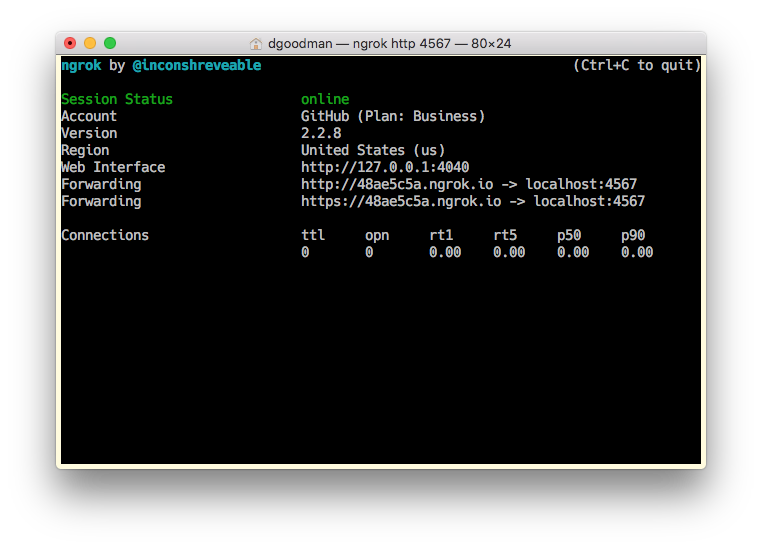
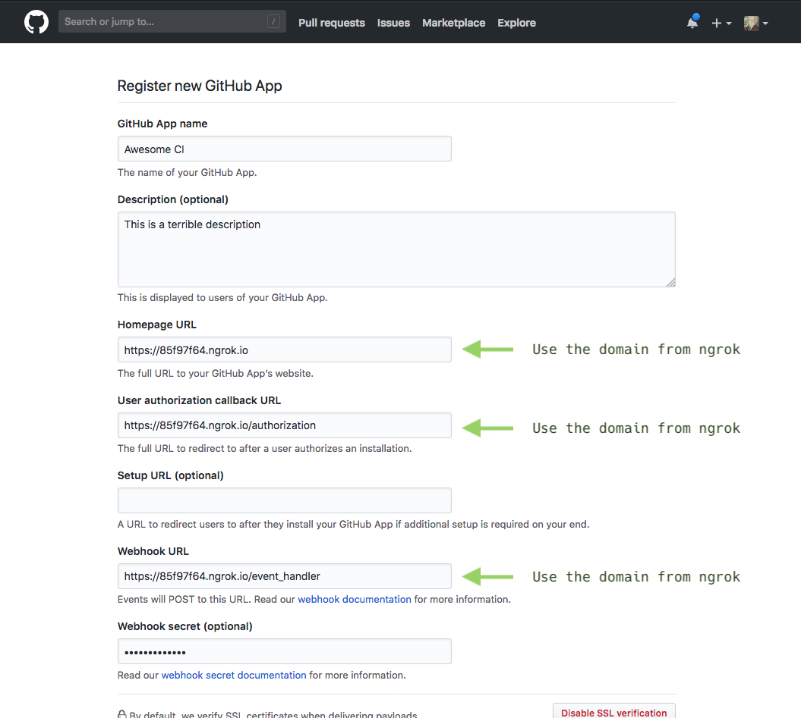
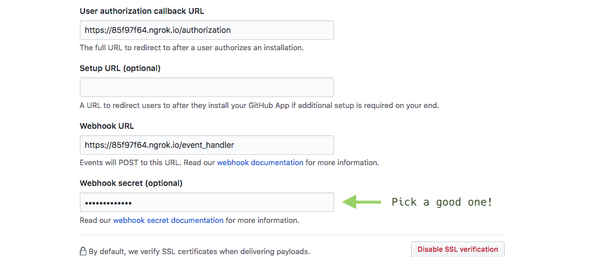

# Building Your First GitHub App

{:toc}

This guide is designed to help you get up and running with the backbone for your own GitHub App. The App we are going to get running won't
do much beyond connect to GitHub. It represents the kind of baseline functionality that you'll need to build something functional. It's the
first step, but it's only the first step.

Once you've worked through this guide, you'll be ready to take the code, and flesh it out into something awesome by taking one of the other
projects in our [app guides][app guides], which are designed to orient you around the various features of the GitHub API.

## Initial Setup

For now, let's assume we are going to develop our app on your local machine, at least to start. We'll be able to move everything onto proper
servers later, but it'll be easier to start with the machine in front of us.

First, let's grab the [boilerplate code][app boilerplate]. Clone or download the boilerplate repository, as you like, and put it somewhere
handy on your local computer. We're going to run it from your personal computer to get started. Later, we'll be able to move our app
onto a hosting provider.

To help GitHub connect to your local computer, to talk to our app, we're going to use a tool called [ngrok][ngrok]. If you haven't already,
[create an account and download ngrok][ngrok]. (Of course, if you're already familiar with ngrok or other similar tools like localtunnel,
feel free to use what you are comfortable with.)

Now we are going to run ngrok: Open up a terminal window (we'll be using this a fair amount, so keep it open!), and type

```bash
ngrok http 4567
```



This command tells ngrok to make port 4567 on your computer available to serve HTTP requests over the open internet. ngrok will assign us a
unique domain that we can use so long as ngrok is running to access your app, even though it will be running on your local machine. We will
need to know this domain for the next step. In the example above, the domain is `48ae5c5a.ngrok.io`.

*Note:* If you quit ngrok, you will lose the domain that was assigned to you, and a new random domain will be assigned to you when you
restart it! So avoid quitting ngrok until you have been able to step through the entire exercise.

## Registering an app with GitHub

Now, we need to tell GitHub about our app. For now, we'll use the domain ngrok provided, but in the future we can update GitHub to point to
our hosting provider. (If at this point you do not yet have a GitHub account, now would be a [great time to join](https://github.com/join).)

Begin by visiting the [app settings page][app settings] in your GitHub profile, and click the "New App" button to begin registering our app
with GitHub.


From here we will be presented with a form to fill out, giving GitHub the details on our new app.
[Follow this guide][creating a github app] for the details on what each field is and requires, but for this guide we have some specific
requirements for how it should be filled out.

* Use the domain issued to us by ngrok. Be sure to include the `/event_handler` path for the Webhook URL, we'll need that later!


* Create a secret to secure our webhook endpoints. This should be something that only you (and GitHub, via this form) know. Remember it for
the next step!


* We must specify a set of permissions for our app—that is, how much data it should have access to. Let's begin with the bare minimum, and
select nothing at all. We'll add permissions as we need them in later guides.

Once you've submitted the form, we'll be taken to the app management page. We have two more things we need to look at.

1. First, be sure to generate a private key for our app. This is necessary for us to authenticate our app later. Hit the green button in
the screenshot, and save the file somewhere where we can find it again.


2. Second, take note of the App ID that GitHub assigns us. It might not look important, but in fact we'll need it so we can tell GitHub who
we are from our app.


OK, that's everything we need from the GitHub site! Let's start playing with code!

## Preparing the runtime environment

At this stage we have: told ngrok to share our app with the world, and regsitered our app with GitHub. Now it is time to, yes, run
our nascent app. It doesn't _do_ anything, of course, but we should verify that we can get everything running just as we expect it to
so there are no surprises down the road.

First, let's take a moment to practice good security hygeine by putting all of our secrets in our computer's memory where our app can find
them (rather than putting them directly in our code). We'll do that by creating some environment variables.

Let's begin with the app id we noted in the previous step. In your terminal, type the following command:
```bash
export GITHUB_APP_IDENTIFIER=12345
```
But instead of `123245`, use the app identifier that GitHub gave you in the previous step.

Now again with the webhook secret we configured:
```bash
export GITHUB_WEBHOOK_SECRET="my secret here"
```
And again, use the secret that you created.

Finally, let's get the private key that we downloaded into the environment. This is a bit trickier! The key is stored in a file that we
downloaded—we want to store it in memory in a way our app can read. THis requires a little bit of transformation. Don't worry about the
details just for now. Supposing the private key was saved as `private-key.pem`, you would type
```bash
export GITHUB_PRIVATE_KEY=`awk '{printf "%s\\n", $0}' private-key.pem`
```

Great! Now we've got our environment prepped—we've stored all of our secrets in memory where our app can read them. Let's run the app!

## Run the boilerplate

In the same terminal where you entered the commands above, we need to install the libraries our server depends upon. The boilerplate server
is written in ruby, so you can type the following to install its dependencies:

``` bash
gem install bundler
```

then

``` bash
bundle install
```

Finally, we can start the server as so:

``` bash
ruby server.rb
```

You should see something like:

```
[2018-05-18 15:07:53] INFO  WEBrick 1.3.1
[2018-05-18 15:07:53] INFO  ruby 2.4.3 (2017-12-14) [x86_64-darwin17]
== Sinatra (v2.0.1) has taken the stage on 4567 for development with backup from WEBrick
[2018-05-18 15:07:53] INFO  WEBrick::HTTPServer#start: pid=2556 port=4567
```

If you see an error instead, make sure that you are running the server in the same window that you typed the various `export ...` commands
above into. If not, try running those commands again before running the server.

Now just give it a test. [Examine your server by clicking here](http://localhost:4567). If everything works as expected, we'll actually see a helpful error page.
![Sinatra's 404 error page][404.png]

This is good! Ironically, it means that our app is running, and everything is in place!

Now, for one last test. Let's install our app into our account on GitHub. Visit the [app management page][app settings] on GitHub, and click
on your app's name. Then click on "Install App"
![App management panel with "Install App" highlighted][images/install.png]

Click the green install button, and follow the prompts.
![App installation page][images/install%202.png]

…and then look at the output in your terminal. You should see something like this.

```
D, [2018-05-18T15:26:09.373705 #3495] DEBUG -- : ---- recevied event installation
D, [2018-05-18T15:26:09.373812 #3495] DEBUG -- : ----         action created
192.30.252.36 - - [18/May/2018:15:26:09 +0200] "POST /event_handler HTTP/1.1" 200 2 0.0065
::1 - - [18/May/2018:15:26:09 CEST] "POST /event_handler HTTP/1.1" 200 2
- -> /event_handler
D, [2018-05-18T15:26:11.248414 #3495] DEBUG -- : ---- recevied event integration_installation
D, [2018-05-18T15:26:11.248459 #3495] DEBUG -- : ----         action created
192.30.252.36 - - [18/May/2018:15:26:11 +0200] "POST /event_handler HTTP/1.1" 200 2 0.0017
::1 - - [18/May/2018:15:26:11 CEST] "POST /event_handler HTTP/1.1" 200 2
- -> /event_handler
```

That's good news! It means our app received a notification that it was installed onto your GitHub account. If you saw something like this,
we're good to go! 🙌


And that's it! Now we have the backbone for our first GitHub App, ready to be fleshed out into something cool.

## Going further

Interested in transforming this boilerplate into something more functional, more…exciting? Follow along with one of
our TODO guides to create your own continuous integration server, or TODO

> THIS SECTION WILL HEAVILY DEPEND ON THE OTHER MORE FOCUSED CONTENT WE WILL HAVE AVAILABLE!

We're excited to see what you build! Feel free to share your creations and your success with us TODO HOW!?

[app guides] /apps/guides/
[ngrok]: https://ngrok.com/
[app boilerplate]: https://github.com/DEGoodmanWilson/app-boilerplate
[app settings]: https://github.com/settings/apps
[creating a github app]: https://developer.github.com/apps/building-github-apps/creating-a-github-app/
